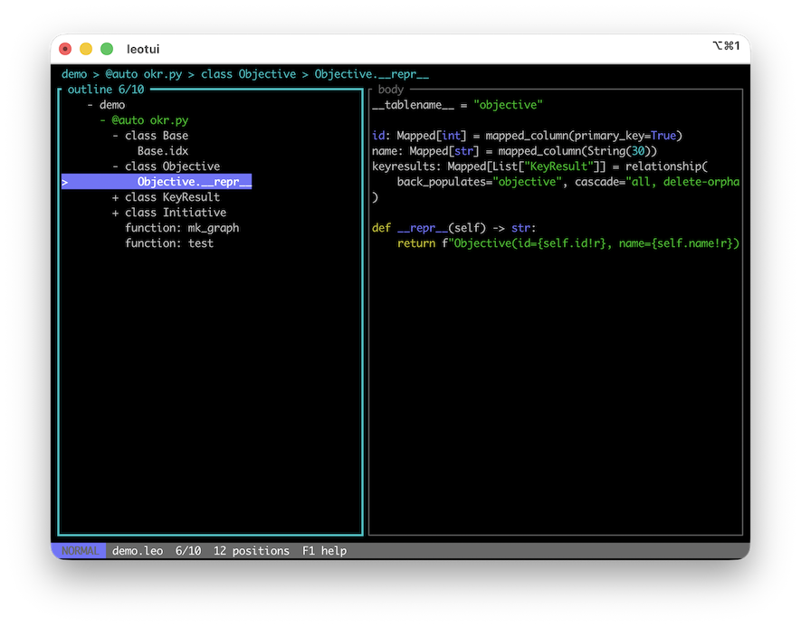

# leo-rs

A Rust implementation of [Leo](https://github.com/leo-editor/leo-editor)'s model layer (`leolib`) and a terminal front end that consumes it (`leotui`).

Leo's outline model was separated from its Qt front end in `leo/leolib`; this port keeps that boundary. `leolib` reads and writes `.leo` files and the external files they refer to, and knows nothing about how any of it is shown. `leotui` is one front end over that crate. Nothing in `leolib` depends on it.



## Status

Verified against `leo/core/LeoPyRef.leo` from the Leo repository:

| check | result |
|---|---|
| nodes read from the `.leo` file | 536, identical gnx/headline/body to Python `leolib` |
| nodes read with all external files | 11,581, identical to Python `leolib` |
| `.leo` file rewritten | byte-identical to the file read |
| external files tangled | 381 of 381 byte-identical to the files on disk |
| `@auto` trees, 1,000 files across 8 languages | 998 identical to Leo's importers; the 2 differences are a deliberate fix |
| `@auto` files written back | 1,008 of 1,010 byte-identical; the 2 exceptions fail in Leo too |

Run those checks with `make test-corpus`. The `@auto` tree comparison needs a Python Leo: see `docs/dev/compare-importers.py`.

## Layout

```
crates/leolib     the model. No view, ever.
crates/leotui     the terminal front end.
```

`leolib` has one runtime dependency for XML parsing (`quick-xml`), one for regular expressions (`regex`), and `once_cell`. `leotui` adds `ratatui` and `crossterm`.

## Using leolib

```rust
let mut outline = leolib::open_outline("myfile.leo", true)?;
for p in outline.all_unique_positions() {
    println!("{}", p.h(&outline));
}
let root = outline.root_position().unwrap();
outline.set_body(&root, "edited with no window in sight\n");
leolib::save(&mut outline, "")?;
leolib::write_external_files(&mut outline, true);
```

`leolib::Document` adds an undo history and the structural commands (insert, delete, clone, copy, paste, move, mark) on top of an `Outline`.

## Using leotui

```sh
leotui FILE.leo
leotui FILE.leo --dump              # one frame, no terminal
leotui FILE.leo --dump --press F1   # press keys, then dump
leotui --keys                       # the binding table
```

or during development

```sh
cargo run -p leotui -- FILE.leo
cargo run -p leotui -- FILE.leo --dump              # one frame, no terminal
cargo run -p leotui -- FILE.leo --dump --press F1   # press keys, then dump
cargo run -p leotui -- --keys                       # the binding table
```

leotui is modal. The pane decides what a key means -- Leo's own `!tree`/`!body` rule -- and `:` reaches every command by name, as Leo's minibuffer does. `F1` shows the bindings in the app; `leotui --keys` prints the same table.

| mode | how you get there | how you leave |
|---|---|---|
| `NORMAL` | the default | |
| `INSERT` | `i` `a` `I` `A` `o` `O` `s` `S` `c` `C` in the body | `Escape` commits, `Ctrl-c` abandons |
| `VISUAL` | `v` `V` in the body | an operator, or `Escape` |
| `HEADLINE` | `e` in the outline | `Enter` commits, `Escape` abandons |
| `COMMAND` | `:` | `Enter` runs it, `Escape` abandons |
| `SEARCH` | `/` `?` | `Enter` keeps the match, `Escape` goes back |
| `HELP` | `F1` | `q` |

### Cheatsheet

<!-- keys:begin -->

**Outline: moving**

| | |
|---|---|
| `j` `k` `Down` `Up` | next, previous visible node |
| `h` `Left` | fold this node, or step out to the parent |
| `l` `Right` `Enter` | unfold this node, or step in to the first child |
| `gg` `Alt-Home` | first node |
| `G` `Alt-End` | last visible node |
| `gp` | parent |
| `{` `}` | previous, next sibling |
| `[m` `]m` | previous, next marked node |
| `]c` `Alt-n` | next clone of this node |

**Outline: folding**

| | |
|---|---|
| `Space` `za` | fold or unfold this node |
| `zo` `Alt-]` | unfold this node |
| `zc` `Alt-[` | fold this node |
| `zR` | unfold every node |
| `zM` `Alt--` | fold every node |
| `zr` `zm` | unfold one level further, fold one level back |
| `zx` | fold everything except the path to this node |
| `z1` `z2` `z3` `z4` `z5` `z6` `z7` `z8` `z9` | unfold to that level |

**Outline: moving a node**

| | |
|---|---|
| `>>` `Shift-Right` | **indent**: make this node a child of the one above |
| `<<` `Shift-Left` | **deindent**: move this node out one level |
| `J` `Shift-Down` | move this node down |
| `K` `Shift-Up` | move this node up |
| `g>` | demote: make the *following siblings* children of this node |
| `g<` | promote: make this node's *children* its siblings |

`>>` moves the node you are on. `g>` and `g<` move other nodes around it.

**Outline: creating and removing**

| | |
|---|---|
| `o` `Insert` | insert a node after this one |
| `O` | insert a node before this one |
| `a` `Ctrl-Insert` | insert a node as the first child |
| `e` | edit the headline |
| `i` | edit the body |
| `dd` | cut this node to the clipboard |
| `Delete` `Backspace` | delete this node |
| `yy` `p` | copy, paste after this node |
| `` ` `` | clone this node |
| `m` `M` | mark or unmark this node, clear every mark |

**Body: a vim buffer**

| | |
|---|---|
| `h j k l` | left, down, up, right |
| `w W b B e E ge` | by word: forwards, back, to the end |
| `0 ^ $ gg G { } %` | line start and end, file, paragraph, matching bracket |
| `f F t T ; ,` | to a character on the line, and repeat |
| `H M L` | top, middle, bottom of the pane |
| `d c y > < gu gU g~` | delete, change, yank, indent, unindent, case |
| `iw aw i" a( ip` | word, quoted, bracketed, paragraph |
| `x X r s S D C Y J ~` | delete, replace, substitute, join, case |
| `i a I A o O` | enter INSERT at the usual vim place |
| `v V` | select charwise, linewise |
| `p P` | put the text register after, before |
| `.` | repeat the last change |

Operators take a count, a motion and a text object: `2d3w`, `ciw`, `da"`, `>>`. One change is one undo, so `A`, two hundred characters and `Escape` is one `u`.

**Both panes**

| | |
|---|---|
| `Tab` `Shift-Tab` | move between the outline and the body |
| `Escape` | in the body, go back to the outline |
| `:` | the command line |
| `/` `?` | search forwards, backwards |
| `n` `N` | repeat the search, and the other way |
| `u` `Ctrl-z` | undo |
| `Ctrl-r` | redo |
| `Ctrl-s` | write the `.leo` file |
| `w` | write the changed external files |
| `Ctrl-f` `Ctrl-b` `PageDown` `PageUp` | a screen down, up |
| `Ctrl-d` `Ctrl-u` | half a screen down, up |
| `Ctrl-Left` `Ctrl-Right` | give the body, the outline more room |
| `:set syntax` `:set nosyntax` | colour the body, or leave it plain |
| `F1` | help |
| `q` | quit |

**The `:` command line**

Every Leo command name, with Tab completion and Up/Down history, plus the vim spellings: `:w` `:w path` `:q` `:q!` `:wq` `:x` `:e path` `:h cmd`. `:N` selects
the Nth visible row. `:set search=all|headlines split=N wrap number syntax`.

**Leo's own chords**

These need a terminal speaking the kitty keyboard protocol (kitty, foot, wezterm, ghostty, alacritty, iTerm2). A legacy terminal cannot send them -- `Ctrl-I` *is* Tab -- so each has a portable binding above. `--no-kitty-keys` turns the protocol off.

| | |
|---|---|
| `Ctrl-i` | insert a node |
| `Ctrl-m` | mark |
| `Ctrl-[` `Ctrl-]` | promote, demote |
| ``Ctrl-` `` | clone |
| `Ctrl-Shift-z` | redo |
| `Ctrl-h` | edit the headline |

<!-- keys:end -->

The body is coloured by the language declared at the node: an `@language` directive in the node or an ancestor, or the nearest `@<file>` node's extension. A node with neither is left plain, so prose is never coloured as code. `@language` lines inside a body move it from that line on, so one node can hold Python and then C; `@nocolor`, `@color` and `@killcolor` work as they do in Leo. `:set nosyntax` turns it off.

Twelve languages -- C, C++, CSS, Go, HTML, Java, JavaScript, JSON, Python, Rust, shell, TypeScript -- are parsed with tree-sitter, which tells a function from a field from a type. Every other language Leo knows a comment delimiter for runs a line scanner instead: comments, strings, numbers, and keywords from Leo's colorizer modes for 33 of them.

Colours come from a Helix theme, read from `~/.config/leotui/themes` or `~/.config/helix/themes`. Nothing is vendored, so the themes are whichever ones you already have. The default is `sonokai`, and without a file of that name leotui uses the terminal's sixteen colours.

`:theme` names the current one. `:theme NAME` changes it, and the themes on disk are listed above the command line as you type. Tab and the arrow keys move through the list, applying each as they land on it, so the outline shows the theme before Enter accepts it. Escape puts back the one you started with. Enter saves the choice to `~/.config/leotui/config.toml`, rewriting only its `theme` line, and the next launch starts there. `--theme NAME` picks a theme for one launch without saving it.

Truecolor is used where the terminal reports it, and reduced to the 256-colour cube or the terminal's sixteen where it does not; `:set colors=true|256|16` overrides the guess.

Flags in the left column: `>` selected, `*` marked, `C` cloned, `~` dirty. `@<file>` nodes are green. The design, and what is still to come, is in `docs/dev/tui-design.md`.

## `@auto`

An `@auto` file is the user's own source, with no sentinels in it. Its structure comes from the language, through a port of Leo's importers.

| | |
|---|---|
| block languages | c, c++, c#, coffeescript, cython, dart, java, javascript, lua, pascal, perl, php, pug, python, rust, scheme, lisp/clojure, tcl, typescript |
| section languages | ini, xml, html |
| line-oriented | org, otl, markdown, treepad |

The file is regenerated from the tree alone, so an importer that dropped a line would overwrite the user's source. Every import is therefore checked: the tree is written back and compared with the file before it is kept, and a tree that fails leaves the whole file in the node's body with an error. Leo does not check this.

Two things an import can change even when it succeeds, both as in Leo: leading tabs become blanks to match `@tabwidth`, and an XML or HTML file gets adjacent tags split onto separate lines. `ReadResult::warnings` names the files it happened to, because the next write changes them on disk.

`@auto-rst` is not ported: its reader and writer are a separate mechanism in Leo, not an importer.

## What else is not ported

- **`@shadow`.** Deprecated in Leo.

- **Unknown attributes are opaque.** Leo pickles them. They round-trip as the hex strings the file spells, and are written back unchanged.

- **`.leojs`** (the JSON outline format).

See `docs/dev/porting-notes.md` for the places this port deliberately differs from Leo, and why.

## Building

```
make build      # cargo build --workspace
make test       # cargo test --workspace
make test-corpus CORPUS=/path/to/LeoPyRef.leo
make lint       # rustfmt --check and clippy -D warnings
```
